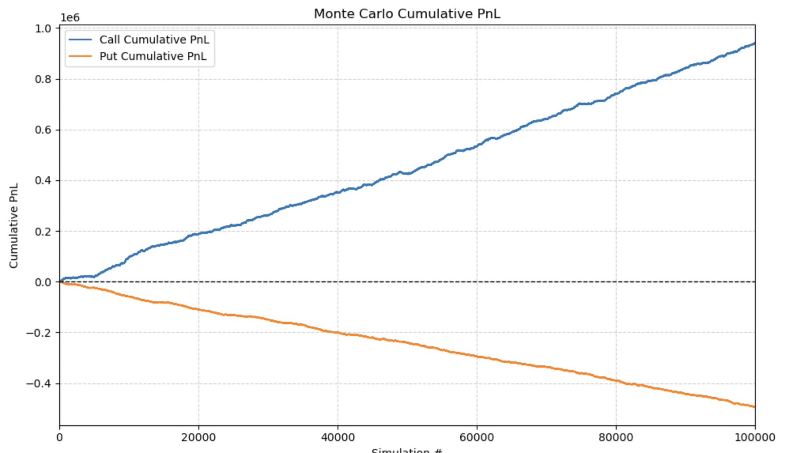
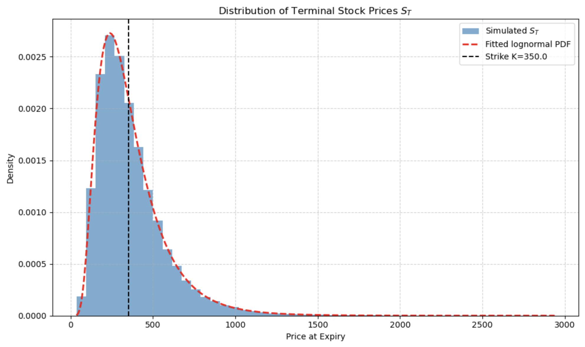
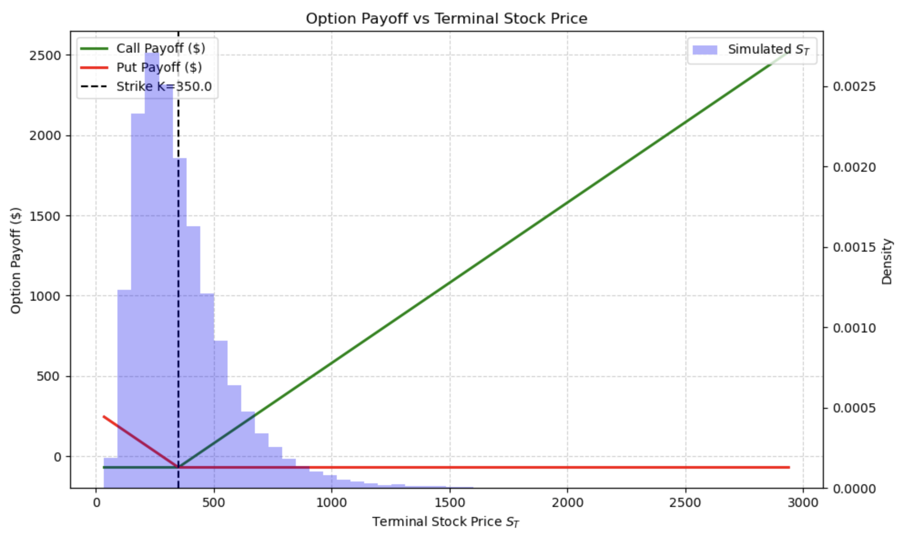

# Quant-Project-Option-Pricing-Implied-Volatility
Python project for pricing European options using the Black-Scholes formula. Includes simulated stock paths using geometric Brownian motion (GBM), vega-weighted implied volatility calculations from market data, and Monte-Carlo simulations visualising profit and loss.

# Quant Options Pricing & Simulation

## Motivation
I built this project to gain insight into how derivatives — specifically options — can be used to generate profits, while also gaining exposure to markets and applying Python to test strategies.

---

## Features
- **Pricing**: European call/put via Black–Scholes with continuous dividend yield `q`.
- **Implied Volatility**: Vega-weighted average IV, solved from market prices (Newton → Brent).
- **Market Data**: Live spot, strikes, expiries, and dividend yield via [yfinance](https://github.com/ranaroussi/yfinance).
- **Simulation**: Risk-neutral GBM paths (vectorized, Euler discretization).
- **PnL**: Multiple conventions — expiry, present value, and opportunity cost.
- **Plotting & Visualization**: 
  - Monte Carlo cumulative PnL for call and put options.
  - Histogram of terminal stock prices with fitted lognormal distribution and strike price marker.
  - Option payoff curves overlaid with simulated stock price distributions.
- **Codebase**: Modular, documented, and formatted (type hints, docstrings, Ruff/Black).

## Notes & Assumptions
- Risk-neutral drift uses `r - q` (risk-free rate minus dividend yield).
- Dividends are approximated from trailing payouts to estimate `q`.
- Model applies to **European options** (no early exercise).
- Implied volatility solver bounds are `(1e-9, 5.0)`; units are annualized decimal vols.
- Monte Carlo simulation uses daily steps (`N = 252`) over the option’s time to expiry.
  
## Planned Improvements
I plan to extend this project with:
- Fitting a full implied volatility surface across strikes and maturities.
- Adding option Greeks (delta, gamma, vega, theta, rho) and P&L sensitivities.
- Implementing delta-hedging and backtesting a simple strategy.
- Extending simulations to stochastic volatility models (e.g. Heston).
- Incorporating bid/ask spreads and transaction costs.

## Installation & Setup
```bash
# Clone this repo
git clone https://github.com/laurenzosaiani/Quant-Project-Option-Pricing-Implied-Volatility.git
cd Quant-Project-Option-Pricing-Implied-Volatility

# Create environment & install dependencies
python -m venv .venv && source .venv/bin/activate
pip install -r requirements.txt
```

## Usage

```bash
python main.py \
  --ticker AAPL \
  --strike 200 \
  --call-prem 5.25 \
  --put-prem 4.80 \
  --expiry-years 0.25 \
  --rate 0.04 \
  --sims 10000
```
## Example Plots

Here are some example plots generated by the simulations in this project.

### Monte Carlo Cumulative PnL
This plot shows the cumulative profit and loss across Monte Carlo simulations for call and put options.



### Distribution of Terminal Stock Prices
Histogram of simulated terminal stock prices ($S_T$) with a fitted lognormal PDF and strike price marker.



### Option Payoff vs Terminal Stock Price
Payoff curves for call and put options overlaid with the histogram of simulated terminal stock prices.



## Requirements
- Python 3.10+
- numpy
- scipy
- matplotlib
- yfinance

## License
This project is licensed under the MIT License. See the [LICENSE](LICENSE) file for details.
